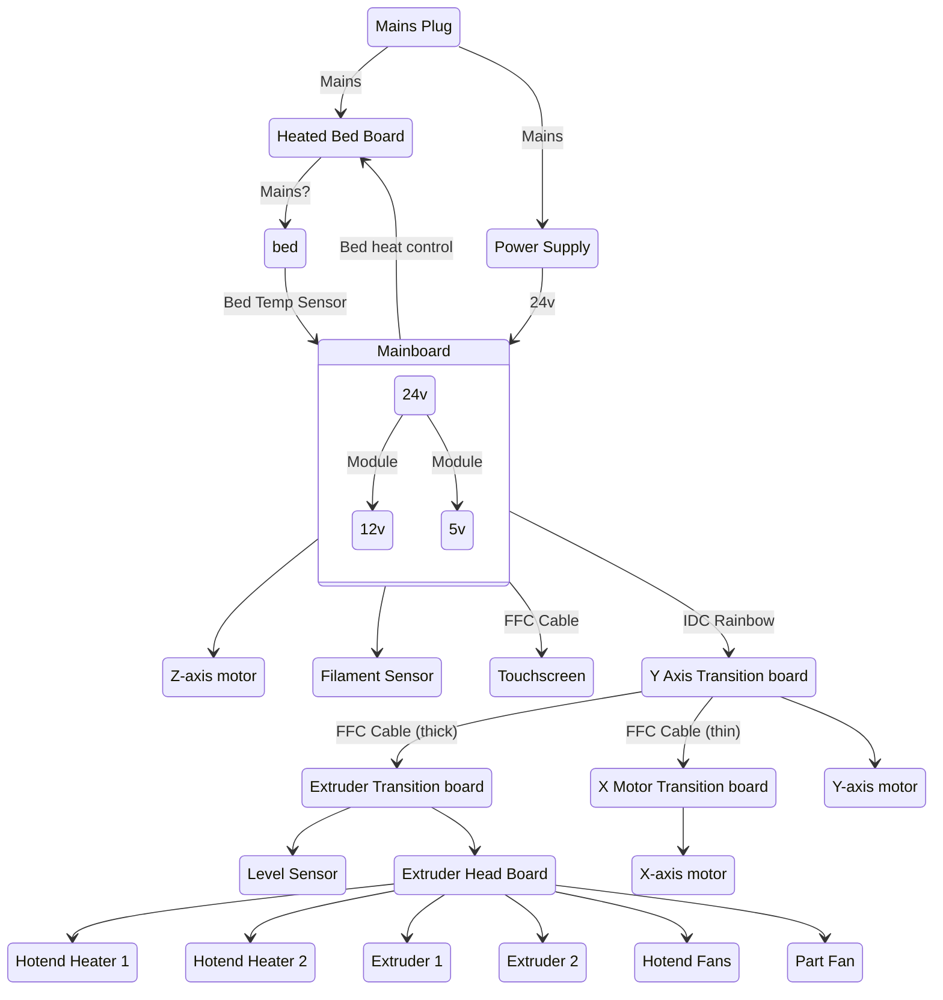

# Cetus2 Electrical Characteristics

I have a late-kickstarter-run model Cetus2 printer, delivered towards the end of January 2023. At this time there have been several fixes applied to the hardware of the printer based on early feedback, but likely there will be additional hardware revisions to come. These notes may not apply to your printer. Before making changes based on this document *please confirm it is still correct for your printer*.

The Cetus2 printer has a variety of different components which make up the entire system. This overview is of the electrical characteristics of the machine and is based on both public documentation and observations/measurements of my own machine.

## General Wiring Diagram

## Overall hardware

### Power Supply

The claim: 350w 24v (14A) PSU.

The actual PSU is a [Delta Electronics PMT-24V100W2BA](https://www.deltapsu.com/en/products/panel-mount-power-supply/PMT-24V100W2BA) that has a max output of 108W. The other 250W is likely the direct AC connection to the heated bed.

The 24V PSU is wired directly to the terminal screws on the mainboard. 

The mainboard contains two switch-mode power supplies to drop the 24v to 5v and 12v, powering other devices. Both of these boards are submodule daughtboards on risers above the mainboard. These are hot-glued onto the board and fairly obviously not user-replacable.

The X, Y, and Z stepper motor drivers are soldered directly to the board, using [TMC2225-SA](https://www.trinamic.com/products/integrated-circuits/details/tmc2225-sa/) for the driver circuit.

### Heated Bed supply

* 5 amp fuse
* 6 large terminal connectors
    * Mains Line
    * Mains Neutral
    * A element +
    * A element -
    * B element +
    * B element -
* 2 pin JST connector to mainboard for control

The heated bed module is fed directly from A/C, it doesn't go through the PSU. As a result it has a voltage switch on the back of the printer with a 110/220 setting.

On my printer the voltage switch _seems to be backwards_ from the labels on the red voltage switch. There is a sticker from Tiertime applied to the printer that contradicts the physical switch's labels, and a note saying it was "configured correctly from the factory" and to "not switch it unless you know what you're doing". I presume somewhere they accidentally rotated the part 180 and may end up fixing this at some point on later models.

#### Heated Bed Element

* Max temp 100C
* Unknown characteristics
* Seems to be two separate heater elements?
* 2 wire temperature probe, goes to mainboard
* Bed is grounded

## Wires

### Main Rainbow Cable

34 wire insulation displacement (IDC) cable between the mainboard and the 

## Mainboard

The connectors have silkscreen labels that are hard to read.

* SD Card Slot
* USB-C Connector
* Screw terminals: 24v main power `JW2`
    * Pin 1: Negative (black)
    * Pin 2: Positive (red)
    * Pin 3: Not connected?
* Z-Axis Motor Port `MZ`
    * 4 pin yellow connector
* Heated bed control `Gt1`
    * 2 pin JST connector, next to 12v module, towards the screw terminals
* Heated bed temp sensor `TB`
    * 2 pin JST connector, next to the filament sensor connector
* Touchscreen FFC cable `Ju2`
    * 10 pins, middle of board
* Filament sensor `Ps`
    * 4 pin connector, middle of board
* Rainbow IDC connector `Pa3`
    * 34 pin connector
* Mystery connector `TH2`
    * 3 pin next to Tiertime logo and screw
    * No documentation, unused?
* Mystery connector `24V`
    * 2 pin next to 12v module and heated bed control.
    * No documentation, unused?
    * 24V on printer boot without initialization. Unclear if it can be controlled.
    * Pin towards the edge is ground, pin towards the center of the board is +24v.
    * Maybe just 24v for the automated build plate?
* Mystery connector `PB5`
    * 3 pin next to rainbow connector
    * No documentation, unused?
    * Maybe "Print Bed" for the automated build plate?
* Mystery connector `5V`
    * 2 pin next to touchscreen FFC connector
    * No documentation, unused?
    * 5V present at boot without initialization. Unclear if it can be controlled.
    * Pin towards the SD card slot is ground, pin towards the FFC touchscreen connector is +5V.
    * Maybe just 5v for the automated build plate?

This is the pinout of the 34 pin rainbow cable going from the mainboard to the Y-axis board.

#### Mainboard PSU submodules

Note that these modules aren't keyed, there is a little silkscreen indicator on the board for which one goes in which spot.

Both are glued down on my board, I can't easily remove them to determine their capabilities.

* 24V -> 12V
* Unknown safe amps
* SKU: BC1814 (Tiertime specific?)

* 24v -> 5v
* Unknown safe amps
* SKU: BC1813 (Tiertime specific?)

## Touchscreen

* FFC Cable (10 pins)
* IDC connector (8 pins)
    * Marked as +3.3v, +5.0v, GND, I/O 14, 15, 16, 17, 18.
    * Undocumented!
    * `M42 P14` controls the part cooling fan, maybe g-code is 0-indexed and these pins are 1-indexed? Unclear!

## Extruder

* 24 pin rainbow IDC cable
* 2x 4 pin hotend connectors
* 2x 4 pin extruder motor connectors

### Hotend cooling fan

* Dual 12v axial fans
* 3 pin DC
* JST connector?
* Unknown if variable voltage
* Unknown safe amp draw

### Part cooling fan

* 12v axial fan
* 2 pins DC
* JST connector? 
* Variable voltage for speed control via I/O pin 14.
* Unknown safe amp draw

Voltage is controlled through GCode. The command `M42 P14 SXXX`, where P14 switches I/O pin 14 (somewhere..) and SXXX is a value between 0 (off) and 511 (12v). Setting this to 250 measured approximately 6v and the fan was running obviously slower. 

Note: Up Studio3 does not expose a setting for part cooling percentages but in the 'Expert' level Printer tab you can alter the Print Cooling command. By setting the S value to lower than 511 you can reduce the fan speed. This appears to directly control the voltage, not the fan speed, so the curve will be exponential instead of linear (a value of 255 would be more like 30% than 50%).

## Other Information

* Tiertime [Mainboard replacement video](https://www.youtube.com/watch?v=QO8WDFXOkRM)
* Tiertime [X-axis FFC cable replacement](https://www.youtube.com/watch?v=rsMtKa8iu3c)
    * My printer came with an extra. Hope I don't need it!
